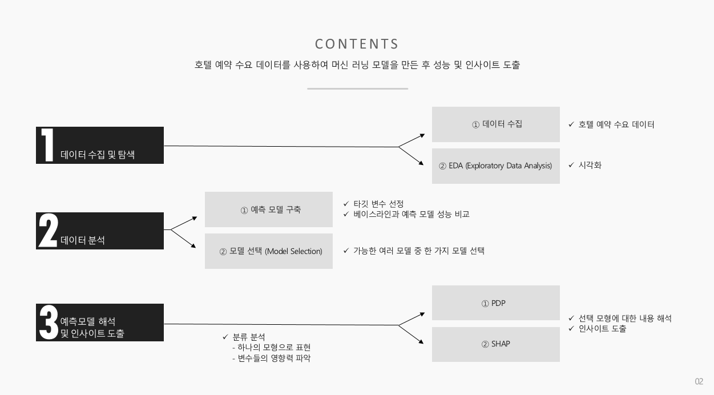

# Hotel Reservation Cancellation Prediction
- 프로젝트 기간: 2021.08.31 - 2021.09.03
---
## 프로젝트 목표

- 탐색적 데이터 분석 진행
- 호텔 예약 수요 데이터를 사용하여 머신러닝 모델을 만든 후 성능 및 인사이트 도출
---

## 데이터셋 설명
- Kaggle 데이터 활용
- 포르투갈(남부 유럽)의 시티 호텔과 리조트 호텔의 예약 정보 수록(2015.07.01 - 2017.08/31)
> - 예약 시기
> - 투숙 기간
> - 성인, 어린이, 유아 수
> - 이용 가능한 주차 공간 수
> - 룸 타입
> - 시장 세그먼트 등
---

## 분석 과정
- 시각화를 통한 탐색적 데이터 분석(EDA)을 함
- 호텔 취소 여부를 타깃 변수로 선정하여 예측 모델 구축을  함
- 실험한 구조 중에서 Accuracy가 가장 높은 모델에 대하여 Cross validation을 사용하여 하이퍼파라미터 튜닝을 진행함
- 베이스라인과 예측 모델 성능을 비교하여 성능이 가장 높은 랜덤포레스트 모델을 선택함
- 타깃 변수에 대한 다른 변수들의 영향력을 파악하고자 PDP와 SHAP을 통해 특성 간의 관계를 파악함
---

## 결과
- 베이스라인 모델보다 약 178% 높은 Accuracy를 가진 모델을 만듦
- 순열중요도와 PDP 분석을 통해 예약한 날짜와 호텔에 도착한 날짜 사이의 기간이 길수록 호텔 예약 취소율이 높아진다는 것과 고객이 사전에 요청한 특별 요청 수가 많을수록 호텔예약 취소율이 낮아진다는 특성 간의 관계를 파악함

---
## 기대효과
이 분석은 호텔의 입장에서 고객의 예약 취소 행동을 더 구체적으로 이해하고 고객의 어려움(Pain Points)에 대해 사전에 대응함으로써 예약 감소를 최소화할 수 있다는 점에서 의미를 찾을 수 있음
>- 호텔의 입장에서 손님이 실제로 올 지 예측 가능
>- 호텔의 인력 및 음식 요구사항 계획 등에 도움
>- 호텔 예약 취소 고객 예측 모델을 통해 취소율이 적은 고객을 타겟으로 마케팅 가능
